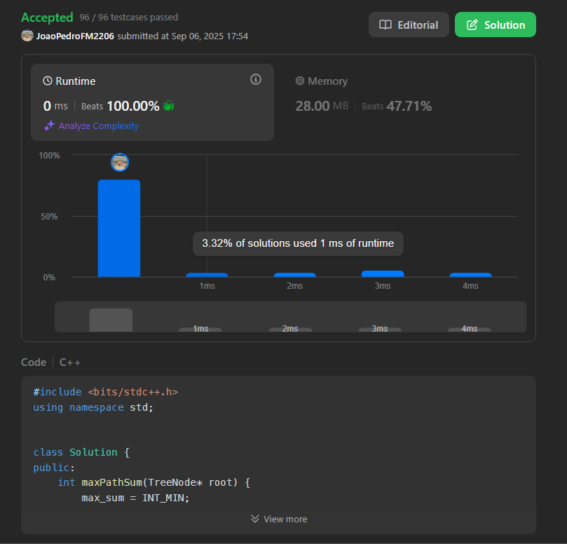
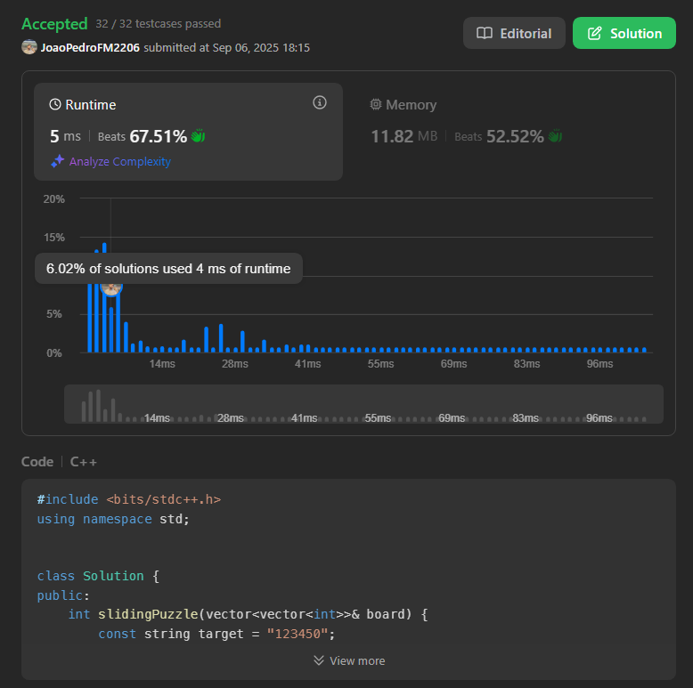

# Trabalho 1: Soluções de Desafios de Grafos (LeetCode)

**Disciplina**: Projeto de Algoritmos (FGA0124) 

**Professor**: Maurício Serrano

## 📖 Sobre o Projeto

Este repositório contém as soluções desenvolvidas para o **Trabalho 1** da disciplina de Projeto de Algoritmos. O objetivo principal foi aplicar e demonstrar o conhecimento teórico adquirido em aula através da resolução de desafios práticos da plataforma LeetCode.

Eu selecionei e implementei a solução para três problemas, sendo os três de nível **Difícil** , focando em diferentes algoritmos e estruturas de dados relacionadas a grafos.

## 👥 Equipe

| Matrícula  | Aluno                               |
| :--------- | :---------------------------------- |
| 231028989 | Joao Pedro Ferreira Moraes          |

## 🛠️ Tecnologias Utilizadas

- **Linguagem:** C++

## 🚀 Desafios Resolvidos

Abaixo estão detalhados os problemas abordados, com uma breve explicação da estratégia utilizada e o comprovante de submissão.

---

### 1. [124. Binary Tree Maximum Path Sum](https://leetcode.com/problems/binary-tree-maximum-path-sum/description/) - (Difícil)

#### **Estratégia:** 
Minha solução usa uma Busca em Profundidade (DFS) recursiva. Para cada nó, a função ela faz duas coisas:
- **1. Ela atualiza a Resposta Global:** Calculando a soma do caminho que "dobra" no nó atual (`nó + ganho_da_esquerda + ganho_da_direita`) e a compara com o máximo global encontrado até agora.
- **2. Ela retorna o Melhor Caminho "Reto":** Retornando para seu nó pai o valor do melhor caminho que pode ser estendido para cima (`nó + max(ganho_da_esquerda, ganho_da_direita)`).

O ponto-chave é ignorar qualquer caminho de uma subárvore que resulte em uma soma negativa (`usando max(0, ganho)`), pois é sempre melhor não incluir um caminho que diminua o total.

**Submissão:**
[Submissão LeetCode 124](https://leetcode.com/problems/binary-tree-maximum-path-sum/submissions/1761915024)

---

### 2. [773. Sliding Puzzle](https://leetcode.com/problems/sliding-puzzle/) - (Difícil)

#### **Estratégia:** 
A estratégia minha foi usar a **Busca em Largura (BFS)**, que é o algoritmo ideal para encontrar o caminho mais curto em problemas como este.

Para organizar tudo, eu faço o seguinte:

- **1. Representação:** Converto o tabuleiro 2D em uma string (ex:` [[4,1,2],[5,0,3]]` vira `"412503"`). O estado final que quero alcançar é `"123450"`.
- **2. Fila:** Utilizo uma fila para armazenar os estados a serem explorados. Cada item na fila será um par: (`estado_atual_string, numero_de_movimentos`).
- **3. Visitados:** Mantenho um conjunto (`set`) para guardar as strings de todos os estados já visitados, evitando loops e trabalho repetido.

O processo da solução é bem direto: começa com o estado inicial na fila. A cada passo, pega um estado, gera todos os vizinhos possíveis (trocando o '0') e, se um vizinho for novo, adiciona à fila e à lista de visitados.

A solução para assim que encontra a string "123450" e retorna o número de movimentos. Se a fila esvaziar antes disso, não tem solução e retorna -1.

**Submissão:**
[Submissão LeetCode 773](https://leetcode.com/problems/sliding-puzzle/submissions/1761926351)

---

### 3. [2392. Build a Matrix With Conditions](https://leetcode.com/problems/build-a-matrix-with-conditions/) - (Difícil)

#### **Estratégia:** 

A minha estratégia para resolver esse problema é simples: eu separo o problema em dois, um para as linhas e outro para as colunas.

Eu vejo que as condições (`'a' antes de 'b'`) são um problema clássico de **Ordenação Topológica**.

- 1- Primeiro, eu aplico a Ordenação Topológica nas `rowConditions` para descobrir a ordem vertical correta de todos os números.
- 2- Depois, eu faço o mesmo para as `colConditions` para encontrar a ordem horizontal.

Se qualquer uma das ordenações falhar (por causa de um ciclo, como `1 acima de 2` e `2 acima de 1`), é impossível uma construir a matriz e retorno uma matriz vazia.

Se ambas funcionarem, eu terei a linha e a coluna para cada número. Aí é só criar a matriz e colocar cada número em sua coordenada (linha, coluna).

**Submissão:**
[Submissão LeetCode 2392](https://leetcode.com/problems/build-a-matrix-with-conditions/submissions/1761939972)

---

## 🎬 Vídeo de Apresentação

A explicação detalhada do raciocínio por trás de cada solução pode ser encontrada nos vídeos abaixo:

[124. Binary Tree Maximum Path Sum](https://youtu.be/2YXfnUjlSPA)

[773. Sliding Puzzle](https://youtu.be/jauDRaut1jY)

[2392. Build a Matrix With Conditions](https://youtu.be/ewPz3X3BHoU)

